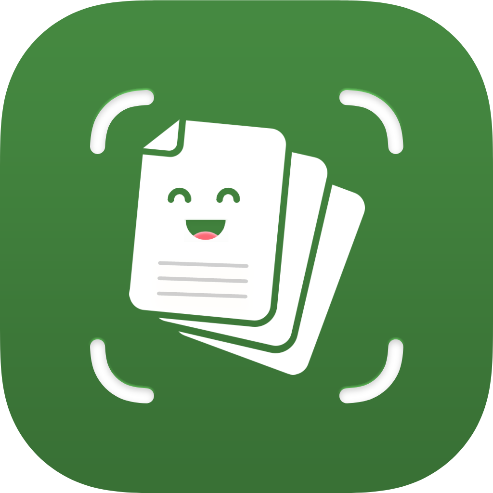

<div align="center">
  

  <h1>Nopalito Scan</h1>

  <p>Android app that captures document pages and generates PDF, JPEG or Word files on the device, with optional cloud storage.</p>
</div>

---

Nopalito Scan is an independent Android project based on
[FairScan](https://github.com/pynicolas/FairScan).
FairScan was developed by Pierre-Yves Nicolas.
Nopalito Scan is not affiliated with or endorsed by FairScan or Pierre-Yves Nicolas.

> **Upstream project:** [pynicolas/FairScan](https://github.com/pynicolas/FairScan)

## What this repository contains

This repository publishes the Android app source. Source headers retain notices for
The FairScan authors (2025-2026) and Ruben Matias (2026, modifications for this fork).

The cloud backend is separate proprietary software operated by Nopalito Scan. It is not
published in this repository, is not open source, and is not self-hostable from this
repository.

## How a scan moves through the app

1. **Capture.** Frame pages with the camera. Automatic detection proposes the document edges.
2. **Prepare.** Perspective is corrected and the image is enhanced. OCR can add selectable text.
3. **Organize.** Rotate, reorder, adjust edges, or remove pages before finishing the document.
4. **Export.** Generate the output file, then save it locally or hand it to the system share sheet.

| Scan                                                | Preview                                             | Save & Share                                        |
|-----------------------------------------------------|-----------------------------------------------------|-----------------------------------------------------|
|  |  |  |

## What the app generates

Implemented export formats (`ExportFormat`: PDF, JPEG, Word):

- PDF (`.pdf`) via PDFBox-Android, with optional OCR text layer and optional password protection.
- Images (JPEG), single file or multi-image set.
- Word (`.docx`) via the local OOXML writer, with optional password protection (ECMA-376 agile
  encryption readable by Microsoft Word).

Included document utilities in the same app:

- Local history of generated files with re-download from the app backup.
- QR scanning from images and QR generation from text or links.
- Compression for PDF, image and Word files.
- Password protection for PDF and Word files.
- Page operations on PDF files: extract, reorder, delete.

## Device processing

Document detection, perspective correction, image enhancement, PDF generation and OCR run on
the device for the base capture-to-file flow:

| Component                  | Purpose                                         |
|----------------------------|-------------------------------------------------|
| Kotlin and Jetpack Compose | Android application and user interface          |
| CameraX                    | Camera capture                                  |
| LiteRT                     | On-device document segmentation model inference (`fairscan-segmentation-model.tflite`) |
| OpenCV                     | Perspective correction and image enhancement    |
| Tesseract                  | Optical character recognition (OCR); language data is downloaded from the official Tesseract project |
| PDFBox-Android             | PDF generation                                  |

Network use on the device: cleartext traffic is blocked (`network_security_config.xml` sets
`cleartextTrafficPermitted="false"`). `INTERNET` is declared for OCR language-data downloads
and for the opt-in cloud actions below. Declared Android permissions are listed in
`app/src/main/AndroidManifest.xml` (camera, storage/media, network state, notifications,
billing, and Wi-Fi/location entries scoped to the optional QR Wi-Fi flow).

## Optional cloud backend

All cloud features are opt-in. Capture, review and file generation on the device do not use
the cloud upload action; a signed-in account is only used when you choose cloud storage or
cloud conversion actions (for example Word import conversion or Word/office previews, which
are converted to a temporary PDF by the backend).

When cloud features are used:

- Files are transmitted with cleartext blocked at the app layer; stored files remain until you
  delete them, then stay in trash for a limited window (server default 30 days, configurable).
- Temporary upload staging is removed automatically (server default 24 hours, configurable).
- A browser can be linked at `/app/cloud` with a QR code or PIN approved in the Android app.
- QR codes can resolve to public URLs served by the backend.

Cloud capacity is provided under plans. Local capture and export remain available without
cloud use.

| Plan     | Included storage | Simultaneous active sessions |
|----------|------------------|------------------------------|
| FREE     | 50 MB            | 1                            |
| PERSONAL | 1 GB             | Up to 5                      |
| PLUS     | 5 GB             | Up to 5                      |

Storage defaults and session caps are enforced server-side
(`storage_limit_bytes` default 52428800, plan constants FREE 50 MB / PERSONAL 1 GB /
PLUS 5 GB, session cap FREE 1 and up to 5 otherwise). A legacy PREMIUM 10 GB plan label
exists in backend constants.

## Origin

This project is a fork of [FairScan](https://github.com/pynicolas/FairScan). FairScan provides
the upstream foundation for the scanning workflow and document-processing stack, including
automatic document detection, perspective correction, image enhancement, and PDF generation.
Please see the upstream repository for its history, contributors, documentation, and original
work.

Nopalito Scan keeps the upstream copyright notices and adds its own for the 2026
modifications. It is an independent project and is not affiliated with or endorsed by
FairScan or Pierre-Yves Nicolas.

## Technical stack

The app builds on an Android stack that includes CameraX, LiteRT, OpenCV, Tesseract and
PDFBox-Android (see Device processing above), plus Room, Retrofit/OkHttp, Credential Manager
/ Play Services Auth, Play Billing, Firebase Cloud Messaging and Coil for the surrounding
app functions.

## Requirements

- Android 8.0 (API level 26) or later
- A device with a camera
- Android Studio and a compatible Android SDK for development

A backend URL is required at build time (`API_BASE_URL` via `-PAPI_BASE_URL`, `local.properties`
or environment; never hardcoded). Release builds require HTTPS.

## Build

Clone this repository and build it using Gradle:

```bash
./gradlew clean check assembleRelease
```

To build an Android App Bundle:

```bash
./gradlew clean check :app:bundleRelease
```

The generated artifacts will be available in the corresponding Gradle build output directories.

## Development

1. Clone this repository.
2. Open the project in Android Studio.
3. Allow Gradle synchronization to finish.
4. Select an emulator or a physical Android device running Android 8.0 or later.
5. Run the `app` configuration.

## Contributing

Contributions are welcome. For substantial changes, please open an issue first to discuss the
proposed work.

- Keep changes focused and clearly described.
- Follow the existing Kotlin and Android project conventions.
- Add or update tests when behavior changes.
- Respect the GPLv3 license and preserve applicable copyright and license notices.

## Acknowledgments

Nopalito Scan is based on [FairScan](https://github.com/pynicolas/FairScan) by its authors and
contributors. Thank you to the FairScan community for the open-source foundation that makes this
fork possible. This acknowledgment does not imply affiliation or endorsement.

## License

Nopalito Scan is distributed under the GNU General Public License v3.0 or later (GPLv3+).
See [LICENSE](LICENSE) for the complete license text.

This fork retains the licensing obligations and relevant notices from its upstream project.
The GPLv3+ terms above apply to the Android app source in this repository only; the
separately operated cloud backend is proprietary and is not covered by this license.
